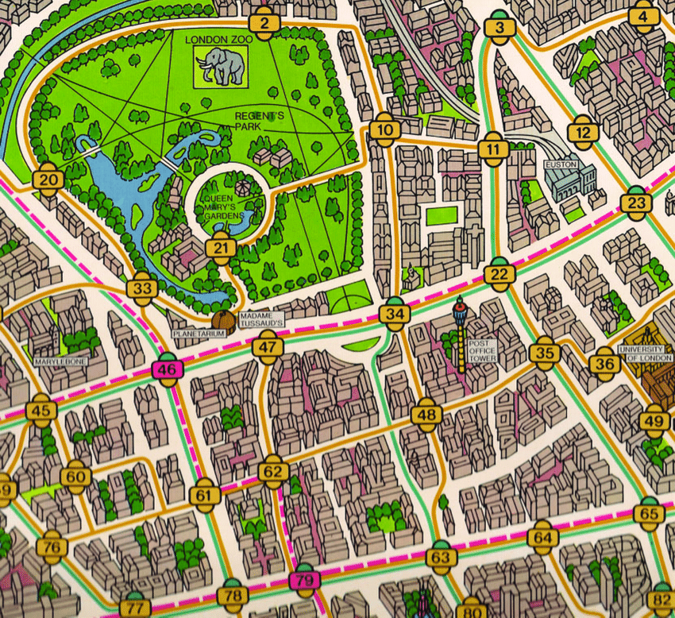
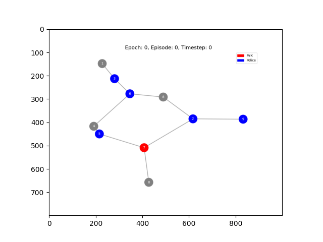
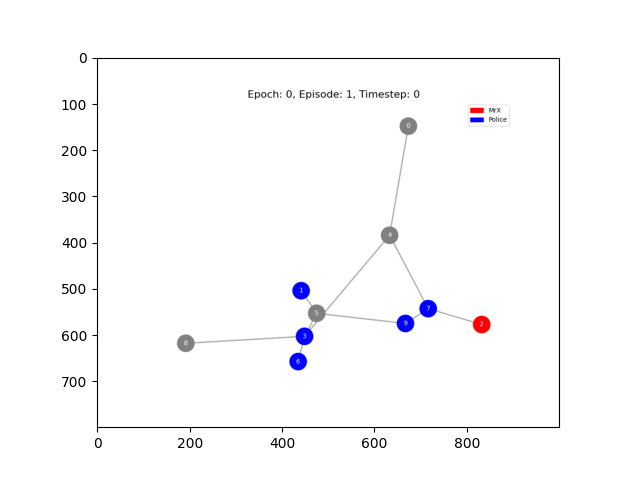
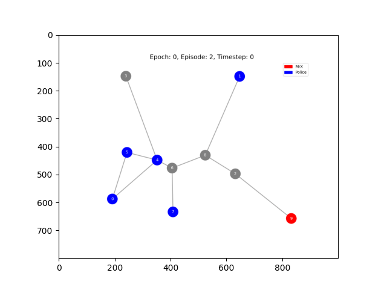
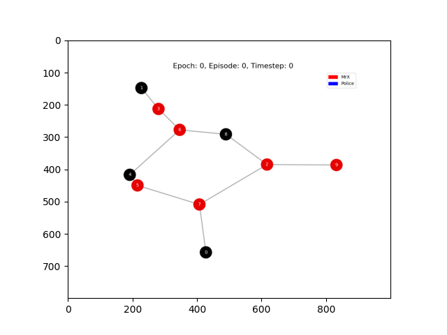
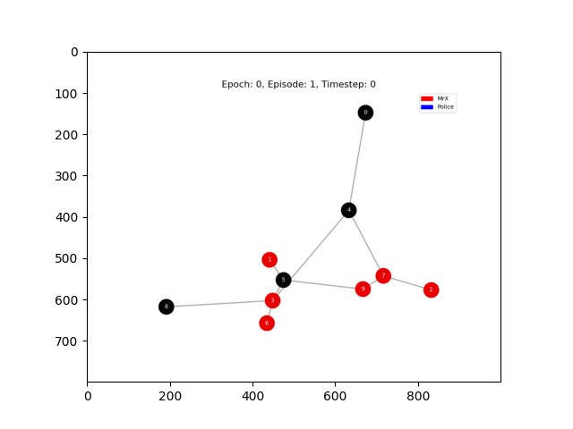
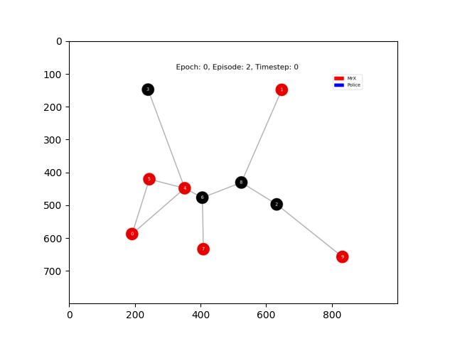

# Scotland Yard: Mechanism Design with Multi-Agent RL

[](https://github.com/elte-collective-intelligence/student-mechanism-design/actions/workflows/ci.yml)
[](https://github.com/elte-collective-intelligence/student-mechanism-design/actions/workflows/docker.yml)
[](https://codecov.io/gh/elte-collective-intelligence/student-mechanism-design)
[](LICENSE)

---

**Welcome to Assignment 2!** 🎉

This is your team's codebase for exploring **mechanism design** in multi-agent reinforcement learning. You'll be working with a Scotland Yard-inspired pursuit-evasion game where police agents try to catch a hidden criminal (MrX) on a graph. Your job is to design mechanisms (budgets, tolls, reveal schedules) that balance the game and study how agents learn to coordinate.



Don't worry if it seems complex at first, this README will walk you through everything step by step!

---

## 📋 Table of Contents

1. [What Is This Project?](#what-is-this-project)
2. [The Environment](#the-environment)
3. [Quick Start](#quick-start)
4. [Your Assignment](#your-assignment)
5. [Available Experiments](#available-experiments)
6. [Experimental Results](#experimental-results)
7. [Understanding the Code](#understanding-the-code)
8. [Configuration & Customization](#configuration--customization)
9. [Metrics & Evaluation](#metrics--evaluation)
10. [Running Ablation Studies](#running-ablation-studies)
11. [Troubleshooting & Tips](#troubleshooting--tips)
12. [Technical Details](#technical-details)
13. [References](#references)

---

## What Is This Project?

### The Big Picture

Imagine you're designing a game between police and a criminal. If you give police too much money or information, they always win. If you give them too little, the criminal always escapes. Your goal is to find the **sweet spot** where the game is balanced (~50% win rate for each side).

This is **mechanism design**: creating rules and incentives that lead to desired outcomes.

### The Game: Scotland Yard

- **MrX**: A single agent trying to evade capture. Moves on a graph, mostly hidden from police.
- **Police**: 2-6 agents trying to catch MrX. They have limited budgets and partial information.
- **The Graph**: A network of nodes (locations) connected by edges (streets) with costs.
- **The Challenge**: Police must coordinate, predict where MrX is going, and manage their resources.

### What Makes This Interesting?

- **Partial Observability**: MrX is only revealed every N steps (e.g., every 5 turns)
- **Resource Constraints**: Police have limited money to spend on movement
- **Coordination**: Multiple police agents must work together
- **Meta-Learning**: The system automatically tunes game parameters to achieve balance

### Technologies Used

- **TorchRL**: Modern RL framework with multi-agent support
- **PettingZoo**: Multi-agent environment interface
- **PyTorch Geometric**: Graph neural networks for spatial reasoning
- **WandB**: Experiment tracking (optional)

---

## The Environment

### What's Going On?

The environment simulates a pursuit-evasion game on a graph:

```
Episode Flow:
1. All agents spawn at random nodes
2. Each turn:
   - MrX moves (hidden from police)
   - Police agents move (paying movement costs)
   - Every N steps, MrX's location is revealed
3. Game ends when:
   - Police catch MrX (same node) → Police win
   - Police run out of money → MrX wins
   - Max timesteps reached (250) → MrX wins
```

### What Do Agents Observe?

Each agent gets a graph-based observation:

| Field | Description |
|-------|-------------|
| **adjacency_matrix** | Which nodes are connected (N×N matrix) |
| **node_features** | One-hot encoding of all agent positions (N×K) |
| **edge_index** | Edge list for GNN processing (2×E) |
| **edge_features** | Movement costs for each edge (E,) |
| **action_mask** | Which moves are legal/affordable (N,) |
| **agent_position** | Current node ID |
| **agent_budget** | Remaining money |
| **belief_map** | Probability distribution over MrX's location (Police only) |

### What Can Agents Do?

- **Action Space**: `Discrete(N)` where N = number of nodes
- **Meaning**: "Move to node X"
- **Constraints**: Can only move to adjacent nodes with affordable costs
- **Invalid Actions**: If no moves are affordable, agent stays in place

### How Do Agents Learn?

Two agent types are implemented:

1. **GNN Agent** (default): Uses graph neural networks to process spatial structure
2. **MAPPO Agent**: Multi-agent proximal policy optimization (actor-critic)

Both learn through self-play over thousands of episodes, gradually improving their strategies.

---

## Quick Start

### Prerequisites

- **Docker** (strongly recommended) OR Python 3.12+
- **GPU** (optional but much faster for training)
- **~2GB disk space** for Docker image

### 🚀 30-Second Quickstart

Let's run your first experiment to make sure everything works:

```bash
# 1. Clone the repo
git clone https://github.com/elte-collective-intelligence/student-mechanism-design.git
cd student-mechanism-design

# 2. Build Docker image (one-time setup, ~5 minutes)
docker build -f ./docker/Dockerfile -t student_mechanism_design .

# 3. Run a quick training experiment (2-3 minutes)
docker run --rm --gpus=all \
  --mount type=bind,src=$PWD,dst=/app \
  student_mechanism_design \
  bash -c "./scripts/run_experiment.sh smoke_train"
```

If you see training logs and no errors, you're good to go! 🎉

### What Just Happened?

The `smoke_train` experiment:
- Created a small graph (15 nodes)
- Spawned 2 police agents + MrX
- Trained for a few episodes
- Saved results to `src/configs/experiments/smoke_train/logs/`

### Local Development (Without Docker)

If you prefer to work without Docker:

```bash
# Install dependencies
pip install -r requirements.txt

# Run experiment locally
./scripts/run_experiment.sh smoke_train

# Or run directly with Python
cd src
python main.py --config experiments/smoke_train/config.yml
```

### Setting Up WandB (Optional but Recommended)

[Weights & Biases (WandB)](https://wandb.ai) provides experiment tracking, visualization, and comparison tools. It's optional but highly recommended for tracking your experiments.

**Step 1: Create a WandB Account**
1. Go to [https://wandb.ai/signup](https://wandb.ai/signup)
2. Sign up (free for academic use)
3. Get your API key from [https://wandb.ai/authorize](https://wandb.ai/authorize)

**Step 2: Configure WandB in the Project**

Copy the template and add your credentials:

```bash
cp src/wandb_data.json.template src/wandb_data.json
```

Then edit `src/wandb_data.json` with your credentials:

```json
{
  "wandb_api_key": "your-api-key-here",
  "wandb_project": "scotland-yard-mechanism-design",
  "wandb_entity": "your-username-or-team"
}
```

⚠️ **Important**: `wandb_data.json` is in `.gitignore` - your API key will NOT be committed to git!

**To disable WandB** (use only local TensorBoard), leave the template values as `"null"`

**Step 3: Verify Setup**

Run a quick experiment and check your WandB dashboard:

```bash
./scripts/run_experiment.sh smoke_train
# Check https://wandb.ai/your-username/scotland-yard-mechanism-design
```

**What Gets Logged to WandB:**
- Training metrics (win rate, episode length, rewards)
- Evaluation results
- Hyperparameters
- System metrics (GPU usage, memory)
- Model checkpoints (optional)

**Using WandB Features:**
```bash
# Compare multiple runs
# Add custom tags to experiments
# Track experiments across different configs
# Share results with your team
```

**Alternative: TensorBoard (Always Available)**

Even without WandB, all metrics are logged to TensorBoard:

```bash
tensorboard --logdir src/configs/experiments/smoke_train/logs/
# Open http://localhost:6006
```

---

## Your Assignment

### Overview

Each team will receive a specific task focusing on a different aspect of the system. Your task will involve:

1. **Implementing** a specific feature or modification
2. **Running experiments** to evaluate your changes
3. **Analyzing results** with ablation studies
4. **Writing a report** documenting your findings

## Available Experiments

The codebase comes with 5 pre-configured experiments. Start with `smoke_train`, then move to `all` for your actual work.

### Experiment Configurations

| Name | Agents | Graph | Budget | Episodes | Purpose |
|------|--------|-------|--------|----------|---------|
| `smoke_train` | 2 | 15 nodes | 10 | 10 | Quick sanity check (3 min) |
| `test` | 2 | 12 nodes | 10 | 20 | Development testing |
| `singular` | 2-3 | 15 nodes | 8-12 | 70 | Single config training |
| `all` | 2-6 | 50 nodes | 4-18 | 70×200 | Full curriculum (hours) |
| `big_graph` | 3-4 | 50 nodes | 10-15 | 70 | Large graph evaluation |

### Running Experiments

**With Docker:**
```bash
# Single experiment
docker run --rm --gpus=all \
  --mount type=bind,src=$PWD,dst=/app \
  student_mechanism_design \
  bash -c "./scripts/run_experiment.sh <experiment_name>"

# Examples:
docker run --rm --gpus=all --mount type=bind,src=$PWD,dst=/app student_mechanism_design bash -c "./scripts/run_experiment.sh smoke_train"
docker run --rm --gpus=all --mount type=bind,src=$PWD,dst=/app student_mechanism_design bash -c "./scripts/train_all.sh"

# Or run interactively:
docker run --rm -it --gpus=all --mount type=bind,src=$PWD,dst=/app student_mechanism_design
# Then inside container: ./scripts/run_experiment.sh smoke_train
```

**Locally:**
```bash
./scripts/run_experiment.sh <experiment_name>

# Or run all experiments:
./scripts/train_all.sh
```

### Where Are Results Saved?

```
src/configs/experiments/<experiment_name>/logs/
├── events.out.tfevents.*    # TensorBoard logs
├── checkpoint_*.pth         # Saved model weights
└── vis/                     # Visualizations (if enabled)
```

View TensorBoard logs:
```bash
tensorboard --logdir src/configs/experiments/all/logs/
# Open http://localhost:6006
```

### Experiment Configuration Files

Each experiment has a YAML config at:
```
src/configs/experiments/<name>/config.yml
```

Edit these to customize:
- Agent configurations (number of police, budget)
- Training hyperparameters (episodes, epochs)
- Graph sizes
- Random seeds

---

## Experimental Results

This section showcases the trained GNN agents playing Scotland Yard on procedurally generated graphs.

### Game Visualizations

The GIFs below show trained Police agents (blue nodes) chasing Mr. X (red node) across different graph configurations:

<table>
<tr>
<td align="center"><b>Episode 1 - Large Graph</b></td>
<td align="center"><b>Episode 2 - Medium Graph</b></td>
<td align="center"><b>Episode 3 - Small Graph</b></td>
</tr>
<tr>
<td></td>
<td></td>
<td></td>
</tr>
</table>

**What you're seeing:**
- 🔴 **Red node**: Mr. X (the evader)
- 🔵 **Blue nodes**: Police detectives (the pursuers)
- **Edges**: Valid movement paths on the procedural graph
- **Animation**: Each frame is one game step

### Belief State Heatmaps

The heatmaps show what the Police agents *believe* about Mr. X's location over time:

<table>
<tr>
<td align="center"><b>Episode 1 - Belief Tracking</b></td>
<td align="center"><b>Episode 2 - Belief Tracking</b></td>
<td align="center"><b>Episode 3 - Belief Tracking</b></td>
</tr>
<tr>
<td></td>
<td></td>
<td></td>
</tr>
</table>

**What you're seeing:**
- **Brighter colors**: Higher probability of Mr. X being at that node
- **Belief updates**: Watch how beliefs sharpen when Mr. X reveals position
- **Spreading**: Beliefs diffuse along edges when Mr. X is hidden

### Key Observations

| Metric | Observation |
|--------|-------------|
| **Coordination** | Police agents learn to spread out and cover the graph |
| **Belief Quality** | Agents maintain accurate beliefs even during hidden phases |
| **Capture Rate** | Trained agents significantly outperform random baselines |
| **Adaptability** | Policies generalize across different graph sizes |

> **Note**: These results are from the `smoke_eval_vis` experiment. For full training, use the `all` or `big_graph` configurations.

---

## Understanding the Code

### Project Structure

```
student-mechanism-design/
├── src/
│   ├── main.py                      # Training entry point (START HERE)
│   ├── README.md                    # 📖 Source code overview & architecture
│   ├── environment/
│   │   ├── README.md                # 📖 Environment documentation
│   │   ├── yard.py                  # Main game environment (605 lines, refactored)
│   │   ├── reward_calculator.py     # Reward computation system (270 lines)
│   │   ├── pathfinding.py           # Dijkstra's shortest paths (138 lines)
│   │   ├── visualization.py         # Game rendering & GIF generation (316 lines)
│   │   ├── action_mask.py           # Legal action computation
│   │   ├── belief_module.py         # Belief tracking for police
│   │   ├── graph_generator.py       # Random graph creation
│   │   ├── graph_layout.py          # Graph sampling utilities
│   │   └── base_env.py              # Base environment utilities
│   ├── agent/
│   │   ├── README.md                # 📖 Agent implementations guide
│   │   ├── gnn_agent.py             # Graph neural network agent
│   │   ├── mappo_agent.py           # Multi-agent PPO
│   │   ├── random_agent.py          # Random baseline
│   │   └── base_agent.py            # Agent interface
│   ├── eval/
│   │   ├── README.md                # 📖 Evaluation & analysis tools
│   │   ├── metrics.py               # Win rate, belief quality, etc.
│   │   ├── exploitability.py        # Strategy robustness testing
│   │   ├── belief_quality.py        # Belief system evaluation
│   │   ├── ood_eval.py              # Out-of-distribution testing
│   │   ├── run_ablations.py         # Ablation study runner
│   │   └── plot_ablations.py        # Visualization of ablation results
│   ├── training/
│   │   ├── README.md                # 📖 Training systems documentation
│   │   ├── gnn_trainer.py           # GNN training loop (318 lines)
│   │   ├── mappo_trainer.py         # MAPPO training loop (319 lines)
│   │   ├── evaluator.py             # Model evaluation system (242 lines)
│   │   └── utils.py                 # Training utilities
│   ├── configs/
│   │   ├── README.md                # 📖 Configuration system guide
│   │   ├── experiments/             # Experiment configurations
│   │   ├── agent/                   # Agent hyperparameters
│   │   ├── logger/                  # Logging settings
│   │   └── visualization/           # Visualization options
│   ├── reward_net.py                # Meta-learning for mechanism design
│   └── logger.py                    # WandB/TensorBoard logging
├── scripts/
│   ├── README.md                    # 📖 Shell scripts documentation
│   ├── run_experiment.sh            # Run single experiment
│   ├── train_all.sh                 # Run all training experiments
│   └── eval_all.sh                  # Run all evaluation experiments
├── test/
│   ├── README.md                    # 📖 Test suite documentation
│   ├── test_action_mask.py          # Action masking tests (5 tests)
│   ├── test_belief_update.py        # Belief tracking tests
│   └── env_test.py                  # Environment tests
├── docker/
│   ├── README.md                    # 📖 Docker setup & troubleshooting
│   └── Dockerfile                   # Docker container definition
├── requirements.txt                 # Python dependencies
└── README.md                        # You are here!
```

**📚 Every directory now has a comprehensive README!** Each subdirectory contains detailed documentation explaining:
- What each file does (line-by-line descriptions)
- How components interact with each other
- Usage examples and best practices
- Tips for students on where to start
- Common tasks and troubleshooting

**Recent Refactoring (January 2026):**
The codebase has been refactored for better maintainability:
- `yard.py` reduced from 1018 → 605 lines (41% reduction)
- Extracted specialized modules: `reward_calculator.py`, `pathfinding.py`, `visualization.py`
- All functionality preserved and tested
- Clearer separation of concerns

### Key Files to Understand

**For most assignments, you'll primarily work with:**

1. **`src/environment/yard.py`** (Main game environment)
   - The main game logic and coordination
   - Observation construction
   - Delegates to specialized modules:
     - `reward_calculator.py` for reward computation
     - `pathfinding.py` for shortest paths
     - `visualization.py` for rendering
   - Termination conditions
   - **Read `src/environment/README.md` for detailed documentation**

2. **`src/agent/gnn_agent.py`** or **`mappo_agent.py`**
   - Agent decision-making
   - Neural network architectures
   - Training loops
   - **Read `src/agent/README.md` for implementation details**

3. **`src/configs/experiments/<name>/config.yml`**
   - Experiment parameters
   - Easy to modify without code changes
   - **Read `src/configs/README.md` for configuration guide**

4. **`src/eval/metrics.py`**
   - Evaluation metrics
   - Where you'll add custom metrics
   - **Read `src/eval/README.md` for evaluation tools**

**Start Here:** Read the README.md files in each subdirectory for comprehensive guides tailored to students!

### Code Flow: How Training Works

```
main.py
  ↓
1. Load config from YAML
  ↓
2. Create environment (yard.py)
  ↓
3. Initialize agents (gnn_agent.py)
  ↓
4. For each epoch:
    ↓
    For each episode:
      ↓
      env.reset() → generate new graph
      ↓
      While not done:
        ↓
        agents.select_action() → choose moves
        ↓
        env.step() → execute moves
        ↓
        compute rewards
        ↓
        agents.update() → learn from experience
  ↓
5. Save models to logs/
  ↓
6. Compute evaluation metrics
```

---

## Configuration & Customization

### Experiment Config Structure

Here's what a typical config looks like:

```yaml
# src/configs/experiments/my_experiment/config.yml

# Agent configurations to try
agent_configurations:
  - num_police_agents: 2
    agent_money: 10
  - num_police_agents: 3
    agent_money: 8

# Training hyperparameters
num_episodes: 70          # Episodes per epoch
num_eval_episodes: 10     # Evaluation episodes
epochs: 200               # Training epochs

# Graph settings
graph_nodes: 50           # Number of nodes
graph_edges: 110          # Requested edges (may vary due to constraints)

# Experiment metadata
wandb_run_name: 'my_experiment'
wandb_resume: false
random_seed: 42
evaluate: false           # Set true for evaluation mode

# Agent type (gnn, mappo, or random)
agent_configs: 'gnn'

# Logging verbosity (default or verbose)
log_configs: 'default'

# Visualization (none, default, or full)
vis_configs: 'none'
```

### Agent Configuration

Agent hyperparameters are in `src/configs/agent/`:

```yaml
# src/configs/agent/gnn.yaml
agent_type: 'gnn'
gamma: 0.99              # Discount factor
lr: 0.001                # Learning rate
batch_size: 64           # Training batch size
buffer_size: 10000       # Replay buffer size
epsilon: 1.0             # Initial exploration rate
epsilon_decay: 0.995     # Exploration decay
epsilon_min: 0.01        # Minimum exploration
```

### Creating Your Own Experiment

```bash
# 1. Copy an existing config
cp -r src/configs/experiments/smoke_train src/configs/experiments/my_experiment

# 2. Edit the config
nano src/configs/experiments/my_experiment/config.yml

# 3. Run it!
docker run --rm --gpus=all \
  --mount type=bind,src=$PWD,dst=/app \
  student_mechanism_design \
  bash -c "./scripts/run_experiment.sh my_experiment"
```

---

## Metrics & Evaluation

### The 3 Core Metrics

Your assignment requires measuring these metrics:

#### 1. 📊 Win Rate (Balance)

**What it measures**: Game balance between police and MrX

```python
Win Rate = (MrX Wins) / (Total Episodes)
Target: 0.50 ± 0.05  # Fair game
```

**Why it matters**: The primary goal of mechanism design. If win rate is far from 50%, the game is unbalanced.

**Implementation**: `src/eval/metrics.py::compute_win_rate()`

#### 2. 🎯 Belief Quality (Cross-Entropy)

**What it measures**: How well police can track MrX's location

```python
Cross-Entropy = -log(belief[true_mrx_position])
Lower is better (0 = perfect prediction)
```

**Why it matters**: Under partial observability, police must infer MrX's location. Better belief → better coordination.

**Implementation**: `src/eval/metrics.py::belief_cross_entropy()`

#### 3. ⏱️ Episode Length

**What it measures**: Game dynamics and efficiency

```python
Time-to-Catch = mean(episode_length | police_wins)
Survival Time = mean(episode_length | mrx_wins)
```

**Why it matters**: Shows strategy effectiveness. Quick catches indicate good coordination; long survival indicates good evasion.

**Implementation**: `src/eval/metrics.py::compute_time_metrics()`

### Running Evaluation

```bash
# Set evaluate=True in config, then run
python src/main.py --config experiments/all/config.yml --evaluate True

# Or use the evaluation script
./scripts/eval_all.sh
```

### Adding Custom Metrics

Edit `src/eval/metrics.py`:

```python
def my_custom_metric(episode_data):
    """
    Compute your custom metric.
    
    Args:
        episode_data: Dict with keys:
            - 'observations': List of observations
            - 'actions': List of actions
            - 'rewards': List of rewards
            - 'winner': 'Police' or 'MrX'
    
    Returns:
        float: Your metric value
    """
    # Your implementation here
    return metric_value
```

---

## Running Ablation Studies

Ablation studies answer: "What happens if I change X?"

### Pre-configured Ablations

#### Ablation 1: Belief Tracking Methods

**Question**: Which belief tracking method works best?

**Variants**:
- `no_belief`: Police have no belief tracking
- `particle_filter`: Standard particle filter
- `learned_encoder`: Neural network-based belief

**Run it**:
```bash
python src/eval/run_ablations.py --ablation belief --num_episodes 100 --seeds 42 123 456
```

**Expected results**:
```
no_belief:         MrX wins ~70-80% (Police can't track)
particle_filter:   MrX wins ~50-55% (Baseline)
learned_encoder:   MrX wins ~45-55% (Better tracking)
```

#### Ablation 2: Mechanism Design

**Question**: Do our mechanisms actually help?

**Variants**:
- `no_mechanism`: Infinite budget, no reveals
- `fixed_mechanism`: Hand-tuned parameters
- `meta_learned`: Auto-tuned for balance

**Run it**:
```bash
python src/eval/run_ablations.py --ablation mechanism --num_episodes 100
```

### Creating Your Own Ablation

1. **Define variants** in a config file:
```yaml
# src/configs/ablation/my_ablation.yaml
variants:
  baseline:
    feature_X: false
    param_Y: 1.0
  
  variant_1:
    feature_X: true
    param_Y: 1.0
  
  variant_2:
    feature_X: true
    param_Y: 2.0
```

2. **Run the ablation**:
```bash
python src/eval/run_ablations.py --ablation my_ablation --num_episodes 50
```

3. **Analyze results** from `logs/ablations/my_ablation_report.txt`

---

## Troubleshooting & Tips

### Common Issues

#### "No such file or directory: ./run_experiment.sh"

**Problem**: Script not in PATH or wrong directory

**Solution**:
```bash
# Run from project root
cd /path/to/student-mechanism-design
./scripts/run_experiment.sh smoke_train
```

#### "Shape mismatch: torch.Size([2, 100]) incompatible with torch.Size([2, 103])"

**Problem**: Graph edge count varies between episodes (already fixed in current version)

**Solution**: This is fixed in the latest code. Pull the latest changes:
```bash
git pull origin main
```

#### Docker GPU not working

**Problem**: `--gpus=all` not recognized

**Solution**: Install NVIDIA Container Toolkit:
```bash
# Ubuntu/Debian
distribution=$(. /etc/os-release;echo $ID$VERSION_ID)
curl -s -L https://nvidia.github.io/nvidia-docker/gpgkey | sudo apt-key add -
curl -s -L https://nvidia.github.io/nvidia-docker/$distribution/nvidia-docker.list | \
  sudo tee /etc/apt/sources.list.d/nvidia-docker.list

sudo apt-get update && sudo apt-get install -y nvidia-container-toolkit
sudo systemctl restart docker
```

#### Out of Memory (OOM)

**Problem**: Training crashes with CUDA OOM

**Solutions**:
1. Reduce batch size in agent config
2. Use smaller graph (fewer nodes)
3. Train without GPU (slower but works)

```yaml
# src/configs/agent/gnn.yaml
batch_size: 32  # Reduce from 64
buffer_size: 5000  # Reduce from 10000
```

### Debugging Tips

#### Enable Verbose Logging

```bash
docker run --rm --gpus=all \
  --mount type=bind,src=$PWD,dst=/app \
  student_mechanism_design \
  bash -c "python src/main.py --config experiments/smoke_train/config.yml --log_configs=verbose"
```

#### Visualize Episodes

Generate GIF animations of episodes:

```bash
# Enable visualization in config
docker run --rm --gpus=all \
  --mount type=bind,src=$PWD,dst=/app \
  student_mechanism_design \
  bash -c "python src/main.py --config experiments/smoke_train/config.yml --vis_configs=full"
```

Results saved to `src/configs/experiments/smoke_train/logs/vis/`

#### Run Unit Tests

The codebase includes comprehensive unit tests:

```bash
# All tests (8 tests, all passing)
docker run --rm --mount type=bind,src=$PWD,dst=/app student_mechanism_design bash -c "pytest test/ -v"

# Specific test file
pytest test/test_action_mask.py -v

# With coverage report
pytest test/ --cov=src --cov-report=html
```

**Current Test Coverage (8 passing tests):**
- ✅ Environment initialization and step operations
- ✅ Action masking with budget constraints (5 tests)
- ✅ Belief update and propagation
- ✅ All components tested after refactoring

**Read `test/README.md` for detailed testing documentation**

#### Check TensorBoard

```bash
tensorboard --logdir src/configs/experiments/all/logs/
# Open http://localhost:6006
```

### Performance Tips

1. **Use GPU**: Training is ~10x faster with GPU
2. **Start small**: Use `smoke_train` to verify changes before full runs
3. **Checkpoint often**: Models auto-save every epoch
4. **Monitor WandB**: Real-time training curves help catch issues early
5. **Read the docs**: Each subdirectory has detailed README files
6. **Run tests first**: `pytest test/ -v` to verify environment works
7. **Check visualizations**: Enable `vis_configs: 'full'` to see agent behavior

### Verified Functionality ✅

The following components have been tested and verified (January 2026):

**Training Systems:**
- ✅ GNN agent training with curriculum learning
- ✅ MAPPO agent training with PPO updates
- ✅ Model checkpointing and loading
- ✅ Adaptive reward shaping
- ✅ Multi-configuration training

**Evaluation Systems:**
- ✅ Model evaluation with greedy policies
- ✅ Win rate and episode length metrics
- ✅ Configuration-specific model loading
- ✅ Evaluation logging and reporting

**Visualization Systems:**
- ✅ Game state rendering
- ✅ Belief heatmap generation
- ✅ GIF animation creation (game + heatmap)
- ✅ Frame capture during evaluation

**Environment Systems:**
- ✅ Refactored modular architecture
- ✅ Reward calculation (all components)
- ✅ Pathfinding (Dijkstra's algorithm)
- ✅ Action masking with budget constraints
- ✅ Belief tracking and updates

**Infrastructure:**
- ✅ Docker build and execution
- ✅ Unit test suite (8/8 passing)
- ✅ Configuration loading system
- ✅ Comprehensive documentation

---

## Technical Details

### Action Masking

The environment uses **fixed index→node mapping** for action spaces:

```python
# Action i always means "move to node i"
action_mask[node_id] = True if (
    adjacency[current_node, node_id] == 1 and  # Adjacent
    edge_cost[current_node, node_id] <= budget   # Affordable
)
```

This ensures:
- Consistent action semantics across episodes
- No need for dynamic action space resizing
- Compatibility with TorchRL's fixed tensor specs

### Graph Generation

Graphs are generated with constraints:

```python
num_nodes = 50
max_edges_per_node = 4
num_edges = min(requested_edges, num_nodes * max_edges_per_node / 2)
```

The actual edge count may be slightly less than requested to satisfy the degree constraint. The environment handles this automatically.

### Belief Tracking

Police agents use belief tracking to estimate MrX's location:

**Particle Filter**:
```python
1. Initialize uniform belief over all nodes
2. On each step:
   - Propagate particles along edges (with noise)
   - Normalize to probability distribution
3. On reveal:
   - Collapse to revealed location
   - Add noise for robustness
```

**Learned Encoder** (optional):
```python
1. Train neural network to predict MrX location
2. Input: recent police observations + actions
3. Output: belief distribution over nodes
```

### Meta-Learning

The `RewardWeightNet` automatically tunes reward weights to achieve target win rate:

```python
1. Observe current win rate
2. Compute loss = MSE(win_rate, 0.5)
3. Adjust reward weights via gradient descent
4. Repeat until balanced
```

This is used for mechanism design research, but you may not need it for your assignment.

---

## References

### Papers

- **MAPPO**: [The Surprising Effectiveness of PPO in Cooperative Multi-Agent Games](https://arxiv.org/abs/2103.01955)
- **Mechanism Design**: [Algorithmic Mechanism Design](https://www.cs.cmu.edu/~sandholm/cs15-892F13/algorithmic-mechanism-design.pdf)
- **Scotland Yard**: [Board Game Reference](https://en.wikipedia.org/wiki/Scotland_Yard_(board_game))

### Documentation

- [PettingZoo Multi-Agent Environments](https://pettingzoo.farama.org/)
- [TorchRL Documentation](https://pytorch.org/rl/)
- [PyTorch Geometric](https://pytorch-geometric.readthedocs.io/)
- [WandB Experiment Tracking](https://docs.wandb.ai/)

### Additional Resources

- [Multi-Agent RL Tutorial](https://github.com/LantaoYu/MARL-Papers)
- [Graph Neural Networks Guide](https://distill.pub/2021/gnn-intro/)
- [Reinforcement Learning Book (Sutton & Barto)](http://incompleteideas.net/book/the-book-2nd.html)

---

## Need Help?

You can contact Tamás Takács on Teams and email for questions related to the project and assignment.

### GitHub Issues

Found a bug? Open an issue:
- [GitHub Issues](https://github.com/elte-collective-intelligence/student-mechanism-design/issues)

### Team Communication

Discuss with your team members! Understanding each other's code and results is part of the learning process.

---

## License

This project is licensed under **CC BY-NC-ND 4.0**. See the [LICENSE](LICENSE) file for details.

**TL;DR**: You can use this for educational purposes but not for commercial use, and you can't redistribute modified versions without permission.

---

**Good luck with your assignment! 🚀**

Remember: Start with `smoke_train` to understand the system, then move to your specific task. Read the code, run experiments, and don't hesitate to ask questions!
